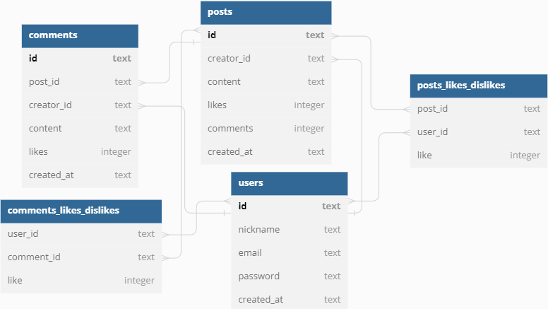

# Labeddit Back-End

# Sobre o projeto

[Link do deploy](https://labeddit-back-end-ourc.onrender.com)

[Link da documentação](https://documenter.getpostman.com/view/24460635/2s93XyT3Ej)

[Link do repositório front-end](https://github.com/Jpbrixner/labeddit-front-end)

Labeddit é um projeto Web Full-Stack desenvolvido no bootcamp da Labenu, onde o objetivo era criar uma aplicação de uma rede social. É divido em 2 repositórios, labeddit-back-end e o labeddit-front-end.

Nessa API, trabalhei com os conceitos de CRUD, POO e arquitetura de dados. Nela você pode criar um usuário, fazer login, criar publicação, dar likes e dislikes nela, e também criar comentários para essas publicações também com likes e dislikes.



# Tecnologias utilizadas
## Back end
- TypeScript
- Axios
- Node
- SQLite
- Express
- UUID
- Bcryptjs
- JWT
- Knex

# Como executar o projeto

## Back end

```bash
# clonar repositório
git clone https://github.com/Jpbrixner/labeddit-back-end

# entrar na pasta do projeto
cd labeddit-back-end

# executar o projeto
npm install
npm run start
```

# Autor

João Pedro Carvalho Brixner

E-mail: jpbrixner1993@gmail.com